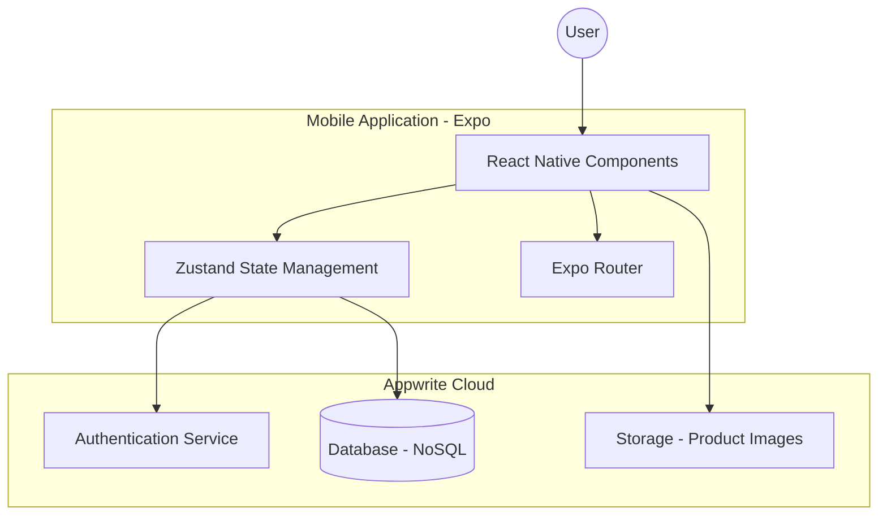
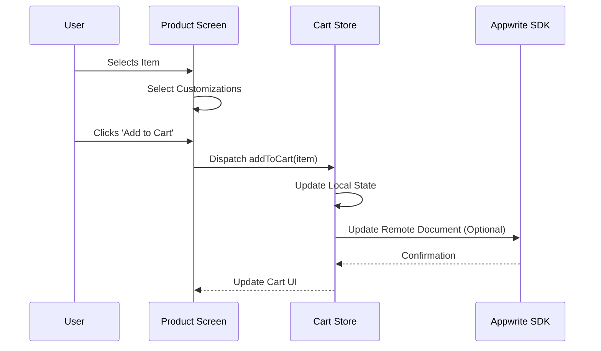
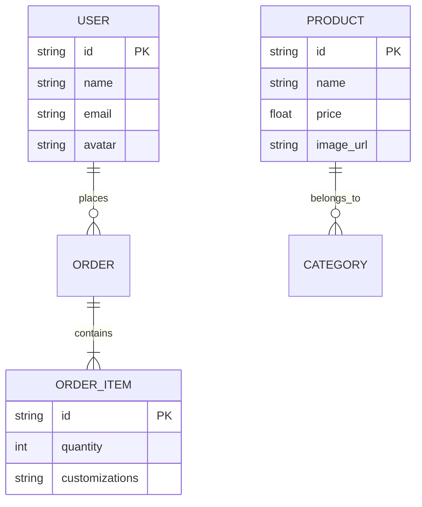

# CraveIt

### A high-performance, cross-platform mobile application for seamless food ordering and meal customization.


CraveIt is a modern mobile solution designed to provide users with an intuitive interface for browsing, customizing, and ordering food. Built with React Native and Expo, it leverages a serverless architecture to ensure high availability and rapid data retrieval.

---

## Visual Diagrams

### System Architecture
The application follows a client-serverless architecture where the frontend communicates directly with Appwrite services for authentication, database management, and file storage.



### Data Flow: Product Selection to Cart
This diagram illustrates the sequence of actions when a user selects a product and adds it to their shopping cart.



### Entity Relationship Diagram
The following schema defines the relationships between core data entities managed within the Appwrite database.



---

## Key Features

*   **Dynamic Customization:** Granular control over ingredients and add-ons for every menu item.
*   **Persistent Authentication:** Secure sign-in and sign-up flows using Appwrite Auth.
*   **Real-time Search:** Optimized search functionality with filtering capabilities for quick menu navigation.
*   **Global State Management:** Efficient cart and user session handling via specialized stores.
*   **Responsive UI:** Optimized for both iOS and Android using Tailwind CSS principles via NativeWind.
*   **Product Catalog:** Rich product details with high-quality image assets and nutritional information.

---

## Tech Stack

| Category | Technology | Purpose |
| :--- | :--- | :--- |
| Framework | Expo / React Native | Cross-platform mobile development |
| Language | TypeScript | Type safety and improved developer experience |
| Backend | Appwrite | Authentication, Database, and File Storage |
| Styling | NativeWind (Tailwind) | Utility-first CSS for mobile components |
| State Management | Zustand | Lightweight and scalable state handling |
| Routing | Expo Router | File-based navigation for React Native |

---

## Quick Start / Installation

### Prerequisites
*   Node.js (v18 or higher)
*   npm or yarn
*   Expo Go app on your mobile device or an emulator (iOS/Android)

### Installation Steps

1.  **Clone the repository**
    ```bash
    git clone https://github.com/TanmayAggarwal87/CraveIt.git
    cd CraveIt
    ```

2.  **Install dependencies**
    ```bash
    npm install
    ```

3.  **Setup Environment Variables**
    Create a `.env` file in the root directory (refer to the Environment Variables section).

4.  **Start the development server**
    ```bash
    npx expo start
    ```

---

## Environment Variables

The application requires the following Appwrite configuration to function correctly.

| Variable | Description | Example | Required |
| :--- | :--- | :--- | :--- |
| `EXPO_PUBLIC_APPWRITE_ENDPOINT` | The API URL for Appwrite | `https://cloud.appwrite.io/v1` | Yes |
| `EXPO_PUBLIC_APPWRITE_PROJECT_ID` | Unique Project ID | `65a...bc1` | Yes |
| `EXPO_PUBLIC_APPWRITE_DATABASE_ID` | Database identifier | `65b...ef2` | Yes |
| `EXPO_PUBLIC_APPWRITE_COLLECTION_ID` | Specific collection ID | `65c...gh3` | Yes |

```env
EXPO_PUBLIC_APPWRITE_ENDPOINT=https://cloud.appwrite.io/v1
EXPO_PUBLIC_APPWRITE_PROJECT_ID=your_project_id
EXPO_PUBLIC_APPWRITE_DATABASE_ID=your_database_id
```

---

## Project Structure

```text
CraveIt/
├── app/                  # Expo Router directory (File-based routing)
│   ├── (auth)/           # Authentication screens (SignIn, SignUp)
│   ├── (tabs)/           # Main application tabs (Home, Search, Cart, Profile)
│   ├── products/         # Dynamic product routes [id].tsx
│   └── _layout.tsx       # Root layout configuration
├── assets/               # Static assets (fonts, icons, images)
├── components/           # Reusable UI components
├── constants/            # Application constants and theme definitions
├── lib/                  # Appwrite configuration and utility functions
├── store/                # Global state management (Auth, Cart)
├── tailwind.config.js    # Tailwind CSS configuration
└── tsconfig.json         # TypeScript configuration
```

---

## Deployment & Architecture Decisions

### Hosting & Infrastructure
The frontend is built using **Expo**, allowing for seamless "Over-the-Air" (OTA) updates. This choice was made to bypass the lengthy app store review process for minor UI updates. The backend is hosted on **Appwrite Cloud**, which was selected over traditional SQL databases to leverage its built-in real-time subscription features and managed security layers.

### Technical Trade-offs
*   **File-based Routing vs Native Navigation:** Expo Router was chosen for its similarity to Next.js, making the codebase more accessible to web developers, despite slightly less flexibility compared to manual React Navigation configurations.
*   **NativeWind:** Using Tailwind CSS on mobile introduces a small build-time overhead but significantly speeds up the styling process and ensures design consistency.

---

## Technical Challenges & Solutions

### Challenge 1: Complex Cart State Synchronization
**Problem:** Managing a cart that includes multiple customizations for the same product ID without overwriting data.
**Solution:** Implemented a unique key generation strategy within the Zustand store that hashes the product ID combined with its specific customization parameters. This allows the cart to treat two identical burgers with different toppings as distinct line items.

### Challenge 2: Asset Loading and Performance
**Problem:** Initial app load was slow due to high-resolution food images.
**Solution:** Integrated an asset pre-loading mechanism in the `_layout.tsx` using `expo-font` and `expo-asset`. We also utilized Appwrite's image transformation API to fetch optimized WebP versions of images based on the device's screen resolution.

---

## Development Commands

| Command | Description |
| :--- | :--- |
| `npx expo start` | Starts the development server |
| `npx expo run:android` | Builds and runs the app on an Android emulator |
| `npx expo run:ios` | Builds and runs the app on an iOS simulator |
| `npm run lint` | Runs ESLint to check for code quality |
| `npx tailwindcss -i ./app/globals.css -o ./output.css --watch` | Watches for Tailwind CSS changes |

---

## Testing Approach

*   **Unit Testing:** Focuses on utility functions in `lib/` and state logic in `store/`.
*   **Component Testing:** Currently verified through manual UI audits using Expo Go.
*   **Future Roadmap:** Integration of Jest and React Native Testing Library for automated component verification and Appwrite service mocking.

---

## Contributing Guidelines

I welcome contributions from the developer community. If you have suggestions for new features or have found a bug, please open an issue or submit a pull request. Let's build a faster, more intuitive food ordering experience together.

---

## Author

Built by [Tanmay Aggarwal](https://github.com/TanmayAggarwal87)

---
## License
This project is licensed under the MIT License.

--made by docify--
